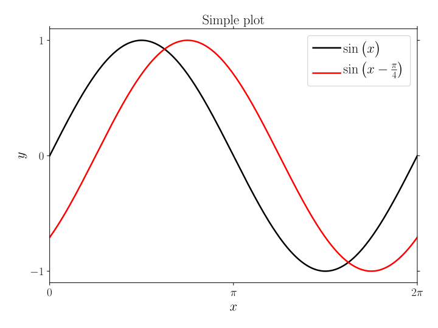
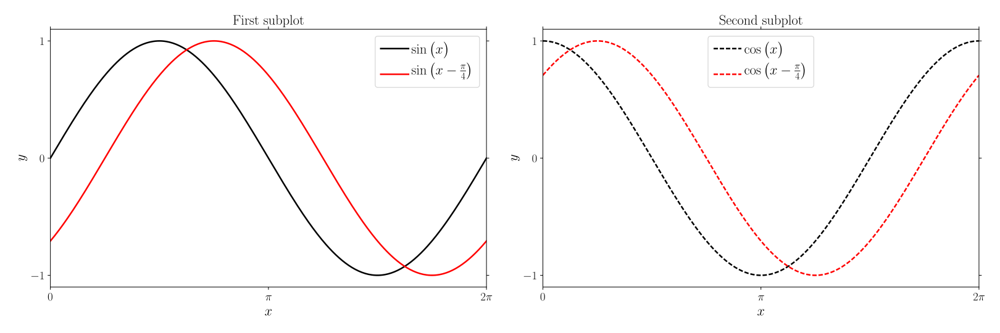
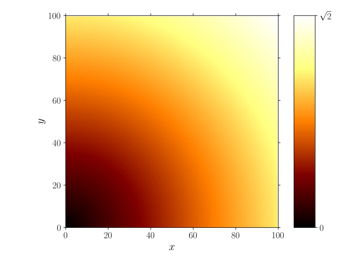
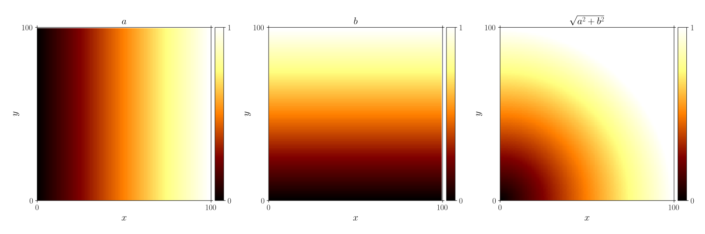

# Outline

<!-- MarkdownTOC -->

- [Customized style](#customized-style)
    - [Overview](#overview)
    - [Tips](#tips)
- [Extension module](#extension-module)
- [Examples](#examples)
    - [Plot](#plot)
    - [Subplot](#subplot)
    - [Image](#image)
    - [Image subplots: tight colorbar](#image-subplots-tight-colorbar)

<!-- /MarkdownTOC -->

# Customized style

## Overview

Matplotlib has a very convenient way to customize plots while minimizing the amount of customized code needed for this. It employs easy-to-switch plotting styles with the same parameters as a `matplotlibrc` file. The only thing needed to switch styles is:

```python
import matplotlib.pyplot as plt
plt.style.use('name_of_custom_style')
```

A number of styles are available. To list them use `plt.style.available`.

Also, one can use one's own style. This is a text-file `name_of_custom_style.mplstyle` stored in a sub-directory `stylelib` of the Matplotlib configuration directory; e.g.:

```bash
~/.matplotlib/stylelib/         # MacOS/Linux
~/.config/matplotlib/stylelib/  # MacOS/Linux
```

The exact directory depends on the operating system and the installation. To find the directory to use on your system, use:

```python
import matplotlib
matplotlib.get_configdir()
```

Two styles are proposed here: [goose](stylelib/goose.mplstyle) and [goose-latex](stylelib/goose-latex.mplstyle) (see [examples](#examples) below). The styles are equivalent with the exception that latter uses LaTeX and the Computer Modern Roman font.

>   More information:
>   
>   *   [matplotlib documentation](http://matplotlib.org/users/customizing.html)

## Tips

### Combining styles

Combining different styles is easily accomplished by including a list of styles. For example:

```python
plt.style.use(['dark_background','presentation'])
```

### Temporary styling

To compose parts of the plot with a different style use:

```python
with plt.style.context(('presentation')):
    plt.plot(np.sin(np.linspace(0, 2 * np.pi)))
```

### Extending

To get the available fields do the following:

```python
import matplotlib as mpl

print(mpl.rcParams)
```

# Extension module

In addition to the customized styles [goose](stylelib/goose.mplstyle), [latex](stylelib/latex.mplstyle), [tick-lower](stylelib/tick-lower.mplstyle), and [tick-in](stylelib/tick-in.mplstyle) this repository provides a number of functions that extend `matplotlib.pyplot`.

# Examples

## Plot

```python
import numpy as np
import matplotlib.pyplot as plt
plt.style.use(['goose','latex'])

x = np.linspace(0,2*np.pi,400)

fig,ax = plt.subplots()

ax.plot(x,np.sin(x)         ,label=r'$\sin \big( x \big)$')
ax.plot(x,np.sin(x-np.pi/4.),label=r'$\sin \big( x - \tfrac{\pi}{4} \big)$')

ax.set_title('Simple plot')

ax.xaxis.set_ticklabels(['0',r'$\pi$',r'$2\pi$'])
ax.xaxis.set_ticks([0,np.pi,2*np.pi])
ax.yaxis.set_ticks([-1,0,1])

plt.legend(loc='upper right')

plt.xlim([0,2*np.pi])

plt.xlabel(r'$x$')
plt.ylabel(r'$y$')

plt.savefig('plot_goose-latex.svg')
```



## Subplot

```python

import numpy as np
import matplotlib.pyplot as plt
plt.style.use(['goose','latex'])

x = np.linspace(0,2*np.pi,400)

# new figure
# ----------

fig = plt.figure(figsize=(18,6))
fig.set_tight_layout(True)

# first subplot
# -------------

ax1 = fig.add_subplot(1,2,1)

ax1.plot(x,np.sin(x)         ,label=r'$\sin \big( x \big)$')
ax1.plot(x,np.sin(x-np.pi/4.),label=r'$\sin \big( x - \tfrac{\pi}{4} \big)$')

ax1.set_title('First subplot')

ax1.xaxis.set_ticklabels(['0',r'$\pi$',r'$2\pi$'])
ax1.xaxis.set_ticks([0,np.pi,2*np.pi])
ax1.yaxis.set_ticks([-1,0,1])

plt.legend(loc='upper right')

plt.xlim([0,2*np.pi])

plt.xlabel(r'$x$')
plt.ylabel(r'$y$')

# second subplot
# --------------

ax2 = fig.add_subplot(1,2,2)

ax2.plot(x,np.cos(x)         ,linestyle='--',label=r'$\cos \big( x \big)$')
ax2.plot(x,np.cos(x-np.pi/4.),linestyle='--',label=r'$\cos \big( x - \tfrac{\pi}{4} \big)$')

ax2.set_title('Second subplot')

ax2.xaxis.set_ticklabels(['0',r'$\pi$',r'$2\pi$'])
ax2.xaxis.set_ticks([0,np.pi,2*np.pi])
ax2.yaxis.set_ticks([-1,0,1])

plt.legend(loc='upper center')

plt.xlim([0,2*np.pi])

plt.xlabel(r'$x$')
plt.ylabel(r'$y$')

# save figure
# -----------

plt.savefig('subplot_goose-latex.svg')
```



## Image

```python
import numpy as np
import matplotlib.pyplot as plt
plt.style.use(['goose','latex'])

x,y = np.meshgrid(np.linspace(0,1,100),np.linspace(0,1,100))
d   = np.sqrt(x**2+y**2)

fig,ax = plt.subplots()

cax = ax.imshow(d)

cbar = fig.colorbar(cax,aspect=10)
cbar.set_ticks([0,np.sqrt(2.)])
cbar.set_ticklabels(['0',r'$\sqrt{2}$'])  # vertically oriented colorbar

ax.xaxis.set_ticks(range(0,101,20))
ax.yaxis.set_ticks(range(0,101,20))

plt.xlim([0,100])
plt.ylim([0,100])

plt.savefig('image_goose-latex.svg')
```



## Image subplots: tight colorbar

```python

import numpy as np
import matplotlib.pyplot as plt
from mpl_toolkits.axes_grid1 import make_axes_locatable

plt.style.use(['goose','latex'])

a,b = np.meshgrid(np.linspace(0,1,100),np.linspace(0,1,100))
d   = np.sqrt(a**2+b**2)

fig  = plt.figure(figsize=(18,6))
fig.set_tight_layout(True)

ax   = fig.add_subplot(1,3,1)
im   = ax.imshow(a,clim=(0,1))
ax.xaxis.set_ticks([0,100])
ax.yaxis.set_ticks([0,100])
plt.xlim([0,100])
plt.ylim([0,100])
plt.xlabel(r'$x$')
plt.ylabel(r'$y$')
plt.title(r'$a$')
div  = make_axes_locatable(ax)
cax  = div.append_axes("right", size="5%", pad=0.1)
cbar = plt.colorbar(im,cax=cax)
cbar.set_ticks([0,1])

ax   = fig.add_subplot(1,3,2)
im   = ax.imshow(b,clim=(0,1))
ax.xaxis.set_ticks([0,100])
ax.yaxis.set_ticks([0,100])
plt.xlim([0,100])
plt.ylim([0,100])
plt.xlabel(r'$x$')
plt.ylabel(r'$y$')
plt.title(r'$b$')
div  = make_axes_locatable(ax)
cax  = div.append_axes("right", size="5%", pad=0.1)
cbar = plt.colorbar(im,cax=cax)
cbar.set_ticks([0,1])

ax   = fig.add_subplot(1,3,3)
im   = ax.imshow(d,clim=(0,1))
ax.xaxis.set_ticks([0,100])
ax.yaxis.set_ticks([0,100])
plt.xlim([0,100])
plt.ylim([0,100])
plt.xlabel(r'$x$')
plt.ylabel(r'$y$')
plt.title(r'$\sqrt{a^2 + b^2}$')
div  = make_axes_locatable(ax)
cax  = div.append_axes("right", size="5%", pad=0.1)
cbar = plt.colorbar(im,cax=cax)
cbar.set_ticks([0,1])

plt.savefig('image_subplots.svg')
```


